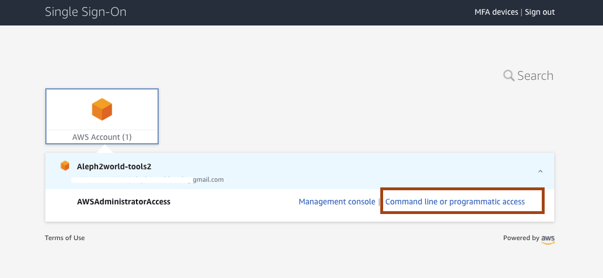
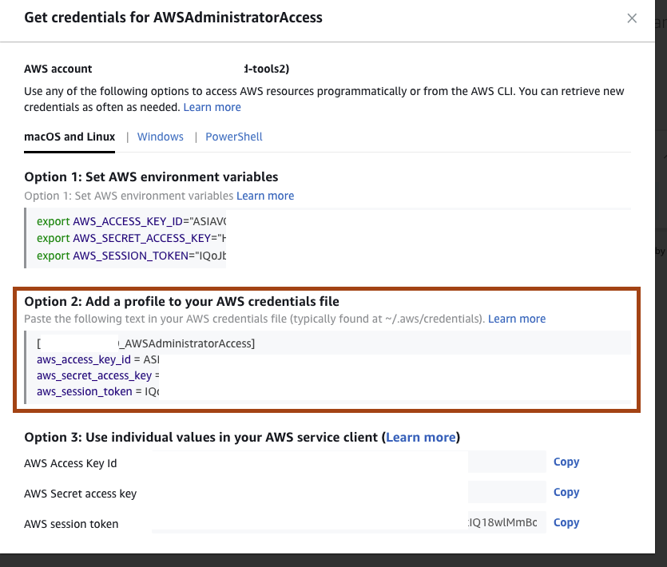

# Purpose 

> Below steps are optional if your IAM user have not enough permissions cloudformation, s3 and kms services to create all required resources 
> Here we will configure permissions for tools account for IAM role only for this particular permission.

# Schema


# Prereqisities

- AWS CLI installed
- URL for Organisation SSO Dashbard is known. It should be an output from step 4 from [main README](../../README.md#pre-requisites)

Example URL
```console
https://d-93677b80d9.awsapps.com/start#/
```

# Configuration steps
- get programatic acess keys from Dev-source account 




- copy data to clipboard from point 2 

```console
[dev]
aws_access_key_id=xxxx
aws_secret_access_key=xxxx
aws_session_token=xxxx
```

- paste into .aws/credentials

```console
[dev]
aws_access_key_id=xxx
aws_secret_access_key=xxx
aws_session_token=xxx
```

- verify identity
```sh
aws sts get-caller-identity --profile dev
```
- create IAM admin user
```sh
aws iam create-user --user-name admin --profile dev
```
- attach policy to user
```sh
aws iam create-policy --policy-name aws-refarch-cross-account-pipeline-sts-and-cloudformation-policy --policy-document file://Permissions-accounts-set-up/Dev/tools-admin-user-policy.json --profile dev
```
- attach policy to user
```sh
aws iam attach-user-policy --user-name admin  --policy-arn "arn:aws:iam::{dev_account_id}:policy/aws-refarch-cross-account-pipeline-sts-and-cloudformation-policy" --profile dev
```
- create IAM role
```sh
aws iam create-role --role-name aws-refarch-cross-account-pipeline-service-role --assume-role-policy-document file://Permissions-accounts-set-up/Tools/trust-relationship-policy.json --profile dev
```
- attach policy to role
```sh
aws iam attach-role-policy --role-name aws-refarch-cross-account-pipeline-service-role --policy-arn "arn:aws:iam::374925447540:policy/aws-refarch-cross-account-pipeline-sts-and-cloudformation-policy" --profile dev
```
- verify 
```sh
aws iam list-attached-role-policies --role-name aws-refarch-cross-account-pipeline-service-role --profile dev
```
- create user credentials
```sh
aws iam create-access-key --user-name admin --profile dev
```
- configure
```sh
aws configure --profile dev_deployer 
AWS Access Key ID [None]: ExampleAccessKeyID1
AWS Secret Access Key [None]: ExampleSecretKey1
Default region name [None]: eu-west-1
Default output format [None]: json
```
- verify
```sh
aws sts get-caller-identity --profile dev_admin
```
- asume role
```sh
aws sts assume-role --role-arn "arn:aws:iam::{YOUR_DEV_ACCOUNT_ID}:role/aws-refarch-cross-account-pipeline-service-role" --role-session-name AWSCLI-Session --profile dev_admin
```

Example ouput:


- Paste the following text in your AWS credentials file (typically found at ~/.aws/credentials). 
```sh
[dev_deployer]
aws_access_key_id = accessKeyIdValue
aws_secret_access_key = secretAccessKeyValue
aws_session_token = sessionTokenValue

```

- verify 
```sh
aws sts get-caller-identity --profile dev_deployer
```
Example output
```json
{
    "UserId": "AROAVOS2MKF2GKH3OSZBB:AWSCLI-Session",
    "Account": "{YOUR_TOOLS_ACCOUNT_ID}",
    "Arn": "arn:aws:sts::{YOUR_TOOLS_ACCOUNT_ID}:assumed-role/aws-refarch-cross-account-pipeline-service-role-2/AWSCLI-Session"
}
```
# Finish 

Your STS aws profile is configured and know for further steps. 

# Troubleshooting 

Sympthom:
Error message:
```console
An error occurred (ExpiredToken) when calling the CreatePolicyVersion operation: The security token included in the request is expired
```

Solution:
Update credentials with session token.

# References

[Video abou STS](https://www.youtube.com/watch?v=-uogKFE1r60)

