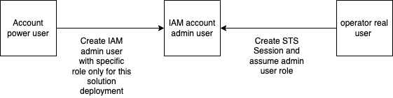

# Purpose 

> Below steps are optional if your IAM user have not enough permissions cloudformation, s3 and kms services to create all required resources.
> Here we configure permissions for accounts to create IAM user and role only for this particular solution.

# Schema

# Steps 
- [Guide for Dev - target account](Dev/README.md)
- [Guide for Tools - source account](Tools/README.md)