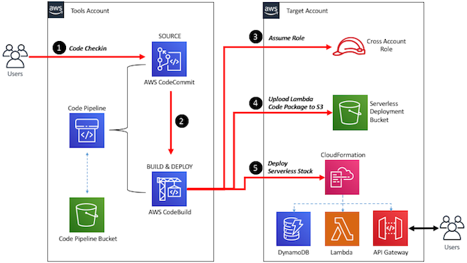

## Introduction

In this project we are going to be implementing cross account deployment strategy explained in [this](https://aws.amazon.com/blogs/devops/aws-building-a-secure-cross-account-continuous-delivery-pipeline/) blog to deployment of Lambda based API’s using third party [Serverless](https://www.serverless.com/) framework.



# Build CI/CD Pipeline for Cross Account Deployment of Lambda API Using Serverless Framework

# Reference Architecture: Cross Account AWS CodePipeline 

This reference architecture demonstrates:
- how to push code hosted in [AWS CodeCommit](https://aws.amazon.com/codecommit/) repository in Development Account
- use [AWS CodeBuild](https://aws.amazon.com/codebuild/) to do application build
- store the output artifacts in S3Bucket
- deploy these artifacts to a Dev-Target AWS account
- validate your deployment then approve the changes to be deployed using [AWS CloudFormation](https://aws.amazon.com/cloudformation/).

> This orchestration of code movement from code checkin to deployment is securely handled by [AWS CodePipeline](https://aws.amazon.com/codepipeline/)

#### Pre-requisites 
1. Install the [AWS CLI](https://docs.aws.amazon.com/cli/latest/userguide/cli-chap-install.html).
2. Intall the [SAM CLI](https://docs.aws.amazon.com/serverless-application-model/latest/developerguide/serverless-sam-cli-install.html).
3. Clone this repository.
4. Have the following AWS accounts (if using Control Tower, [this is useful](https://docs.aws.amazon.com/controltower/latest/userguide/account-factory.html#quick-account-provisioning)):
    * Tooling - Source 
    * Development - Target 
5. Create permissions for Development - Target account (optional)

If you want to create IAM user and role only for this particular deployment please follow the instructions from [Set up additional tools account permissions](Permissions-accounts-set-up/Dev/README.md)
If your profile user has enough permissions, this step can be skipped. 

6. Create permissions for tools account (optional)

If you want to create IAM user and role only for this particular deployment please follow the instructions from [Set up additional tools account permissions](Permissions-accounts-set-up/Tools/README.md)
If your profile user has enough permissions, this step can be skipped. 

#### 1. Deploy Development - Target account roles

- deploy IAM role  

```sh
aws cloudformation deploy --stack-name cross-account-role --template-file cloudformation/target-account/cf-CrossAccountRole.yml --capabilities CAPABILITY_NAMED_IAM --parameter-overrides ToolsAccountID=${ToolsAccountID} --profile dev_deployer 
```

- deploy to be used by Cloudformation Service to create resources

```sh
aws cloudformation deploy --stack-name cross-account-execution-role --template-file cloudformation/target-account/cf-CloudFormationExecutionRole.yml --capabilities CAPABILITY_NAMED_IAM --parameter-overrides ToolsAccountID=${ToolsAccountID} --profile dev_deployer 
```

#### 2. Deploy Tooling - Source account roles

- deploy pipeline stack

```sh
aws cloudformation deploy --stack-name codecommit-repository-and-cicd-pipeline  --template-file cloudformation/source-account/cf-ServerlessDeployPipeline.yml --capabilities CAPABILITY_NAMED_IAM --parameter-overrides TargetAccountID=${DevToolsID}  --profile tools_deployer 
```

- record codecommit URL repo 

AWS Console - Cloud Formation - stack 'codecommit-repository-and-cicd-pipeline' - outputs - OutCodeCommitRepoUrl


# Troubleshooting

If we have a problem with not enough permissions and Cloudformation stack fail then we should:


- remove stack

```sh
aws cloudformation delete-stack --stack-name codecommit-repository-and-cicd-pipeline --profile tools_deployer
```
- i.e update policy input file file like Permissions-accounts-set-up/Tools/tools-admin-user-policy.json or Permissions-accounts-set-up/Dev/tools-admin-user-policy.json

- update policy 
```sh
aws iam create-policy-version  --policy-arn arn:aws:iam::374925447540:policy/aws-refarch-cross-account-pipeline-sts-and-cloudformation-policy  --policy-document file://Permissions-accounts-set-up/Tools/tools-admin-user-policy.json --profile aleph_tools  --set-as-default
```

- deploy stack again

Example command:
```sh
aws cloudformation deploy --stack-name codecommit-repository-and-cicd-pipeline  --template-file cloudformation/source-account/cf-ServerlessDeployPipeline.yml --capabilities CAPABILITY_NAMED_IAM --parameter-overrides TargetAccountID=226858071640   --profile aleph_tools_deployer
```

## License

This library is licensed under the MIT-0 License. See the LICENSE file.

